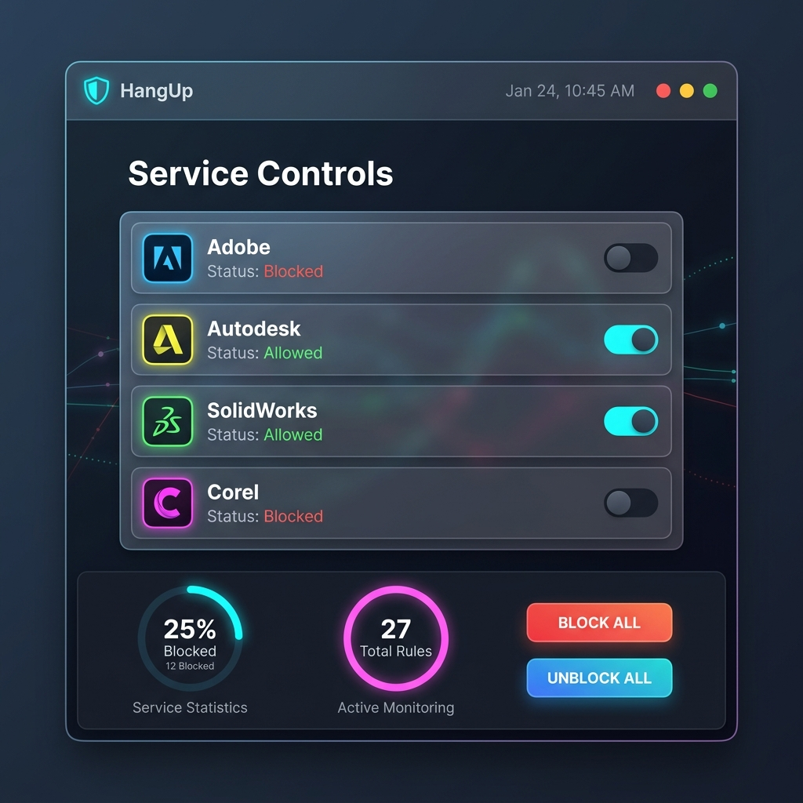

# 🚫 HangUp
### Internet Blocker for Design & Engineering Apps — macOS Edition
**by pppoipoit x DRKMTTR Studio © 2026**

> Cut internet access for Adobe, Autodesk, Corel, and SolidWorks — with a single GUI toggle.

[]()
[]()
[]()
[]()
[]()
[]()

[]()
[]()
[]()
[]()
[]()

[]()
[]()
[]()
[]()
[]()
[]()
[]()

---



## ❓ What is this?

**HangUp** is a one-click network blocker for design and engineering software.
Creative suites constantly phone home to telemetry and license servers, which can
make large apps feel sluggish and trigger repeated activation attempts.

HangUp blocks **just those applications**. Your browser, email, and everything
else stay online.

## 🍎 Why macOS needs a separate app

macOS has no equivalent of the Windows application firewall, so this edition
uses a different strategy:

| | Windows Edition | macOS Edition (this branch) |
|---|---|---|
| Blocking mechanism | Windows Firewall COM API (`INetFwPolicy2`) | `/etc/hosts` rewrite + `launchctl` |
| Granularity | Per-application (`.exe` path) | Per-domain + background daemons |
| Privilege model | UAC elevation | Native `osascript` sudo prompt |
| UI toolkit | Custom GDI+ | Avalonia UI (AcrylicBlur glassmorphism) |

> macOS Application Firewall only filters **incoming** connections, and `pf`
> works on ports/IPs rather than app paths. Writing a Network Extension
> (Little Snitch style) would require Apple Developer approval, so we block the
> domains and agents directly instead.

## ✨ Features

- **Per-app toggles** for Adobe, Autodesk, SolidWorks, and Corel.
- **Block All / Unblock All** one-click controls.
- **Live statistics** — blocked ratio, total domain rules, active monitoring.
- **Native `.app` bundle** for Apple Silicon and Intel — no Rosetta needed.
- **No telemetry, no ads, no accounts** — fully offline operation.

## 💻 Requirements

| Item | Requirement |
|---|---|
| OS | macOS Monterey (12) or later |
| Arch | Apple Silicon (arm64) **or** Intel (x64) — pick the matching download |
| Privileges | Administrator password required (to edit `/etc/hosts`) |
| Rosetta | Not required on either architecture |

## 🚀 Installation (macOS)

1. From the [latest release](https://github.com/pppoipoit/Hang-Up/releases),
   download the build that matches your Mac:
   - `HangUp-macOS-arm64.app.zip` → **Apple Silicon** (M1/M2/M3/M4)
   - `HangUp-macOS-x86_64.app.zip` → **Intel**
2. Unzip it — it extracts as `HangUp-AppleSilicon.app` or `HangUp-Intel.app`.
   The zip preserves Unix execute permissions, so no Terminal is needed.
3. Move the `.app` to `/Applications`.
4. **Right-click → Open** the first time (see Gatekeeper note below).

### 🍎 Gatekeeper / "app is damaged" (expected — app is unsigned)

HangUp is **ad-hoc signed** and not notarised, because it has no paid Apple
Developer certificate. macOS will quarantine it on first launch. Any one of
these works:

```bash
# Remove the quarantine attribute
xattr -rd com.apple.quarantine /Applications/HangUp-AppleSilicon.app

# Or clear all extended attributes
xattr -cr /Applications/HangUp-AppleSilicon.app
```

Or simply **right-click the app → Open** instead of double-clicking.

<details>
<summary>Advanced: re-sign the bundle yourself</summary>

```bash
codesign --force --deep --sign - /Applications/HangUp-AppleSilicon.app   # Apple Silicon
codesign --force --deep --sign - /Applications/HangUp-Intel.app          # Intel
file /Applications/HangUp-AppleSilicon.app/Contents/MacOS/HangUp.Mac.App # verify arch
```
</details>

## ⚙️ How it works

1. **Domain blocking** — telemetry/license domains are written into
   `/etc/hosts`, pointed at `127.0.0.1`.
2. **Service blocking** — Adobe background daemons are unloaded via
   `launchctl bootout` so they cannot bypass the hosts entry.
3. **Privilege escalation** — a native `osascript` prompt asks for your
   password; the new hosts file is written atomically from `/tmp`.

## 🛠 Building from source

Both macOS builds can be produced **from Windows** using the bundled script:

```powershell
git clone https://github.com/pppoipoit/Hang-Up.git
cd Hang-Up

# Apple Silicon + Intel (both .app bundles and .zip packages)
./build-mac.ps1 -Arch all

# Single architecture
./build-mac.ps1 -Arch arm64
```

Output lands in `dist/`. Or build a single runtime directly:

```bash
dotnet publish "src/HangUp.Mac.App/HangUp.Mac.App.csproj" -c Release -r osx-arm64 --self-contained true
dotnet publish "src/HangUp.Mac.App/HangUp.Mac.App.csproj" -c Release -r osx-x64  --self-contained true
```

Requirements: [.NET 8 SDK](https://dotnet.microsoft.com/download/dotnet/8.0).
`build-mac.ps1` assembles the `Contents/MacOS`, `Contents/Resources`, and
`Info.plist` bundle structure that plain `dotnet publish` does not produce.

## 🏗 Project structure

```
HangUp.Mac.slnx
src/
  HangUp.Mac.Core/   Models, apps.json config, MacFirewallManager (blocking engine)
  HangUp.Mac.App/    Avalonia UI (XAML) + ViewModels
build-mac.ps1        Builds and packages .app bundles + .zip for both architectures
dist/                Build output (git-ignored)
```

## 🪟 Windows Edition

The Windows version is a separate codebase on the
[`main`](https://github.com/pppoipoit/Hang-Up/tree/main) branch and uses the
Windows Firewall API instead of `/etc/hosts`.

## ⚠️ Disclaimer

**Use at your own risk.** HangUp rewrites `/etc/hosts` and unloads system
launch agents, which requires your administrator password. Interfering with
software licensing can cause activation failures or unsupported states in
vendor products. HangUp is not affiliated with, endorsed by, or supported by
Adobe, Autodesk, Dassault Systèmes, or Corel. A backup of `/etc/hosts` is kept
in `/tmp` during each operation — verify you can still reach the internet
before relying on this tool.

## 👥 Credits & Contributors

- Project Lead / Core Developer: **pppoipoit** (DRKMTTR Studio)
- Development Assistant: **Annie** (Google Antigravity)
- macOS Build & Testing: *TBD*
- Windows Build & Testing: *TBD*

See [`CREDITS.md`](CREDITS.md) for the full list and third-party acknowledgements.

## 📄 License

This project is licensed under **CC BY-NC-ND 4.0**.

**Free for personal and educational use only.** You are **NOT** permitted to
sell, redistribute for profit, or use this software commercially. You may not
distribute modified versions. You must credit the developers.

Full legal text: [`LICENSE`](LICENSE)

---

## 🏗 โครงสร้างโฟลเดอร์ (Project Structure) — AI Developer Guide

โปรเจกต์นี้คือ **HangUp** เวอร์ชันสำหรับ **macOS** ซึ่งพัฒนาแยกต่างหากจากเวอร์ชัน Windows เนื่องจากสถาปัตยกรรมระบบ (โดยเฉพาะเรื่อง Firewall และ Background Services) ของ Mac แตกต่างจาก Windows อย่างสิ้นเชิง

## 🏗 โครงสร้างโฟลเดอร์ (Project Structure)

โปรเจกต์ถูกแบ่งออกเป็น 2 ส่วนหลัก เพื่อให้ง่ายต่อการดูแล:

*   **`HangUp.Mac.sln`** - Solution หลักของระบบ
*   **`src/HangUp.Mac.Core/`** - **(หัวใจของระบบ)** จัดการระบบบล็อก, คอนฟิก, โมเดล
    *   `Models/` - เก็บโครงสร้างข้อมูล เช่น `AppProfile.cs` (แอปที่จะบล็อก)
    *   `Config/` - จัดการไฟล์ `apps.json` และการตั้งค่าต่างๆ
    *   `Firewall/` - **(สำคัญมาก)** โค้ดที่ใช้ยุ่งกับระบบ Mac เช่น `MacFirewallManager.cs` จะอยู่ที่นี่
*   **`src/HangUp.Mac.App/`** - **(หน้าตาแอป)** พัฒนาด้วย **Avalonia UI** เพื่อให้ได้หน้าตาแบบ Glassmorphism สวยงามเหมือน Mac แท้ๆ และสามารถเขียน/ทดสอบ UI บน Windows ได้
    *   `Views/` - เก็บไฟล์ XAML สำหรับหน้าจอ
    *   `ViewModels/` - เก็บ C# ลอจิกสำหรับผูก Data เข้ากับ UI (MVVM)
    *   `Assets/` - เก็บรูปภาพไอคอน `.png`

---

## 🤖 คำแนะนำสำหรับ AI ตัวอื่นๆ (AI Developer Guidelines)
**(For AI Assistants like Cline, Cursor, or ChatGPT)**

If you are an AI assistant continuing this project, **PLEASE READ THIS CAREFULLY**:

### 1. Architecture & Blocking Strategy
macOS does NOT allow path-based outgoing firewall blocking easily without a Kernel/Network extension. **DO NOT attempt to use `pfctl` to block `.app` paths.** 
Our strategy for macOS is:
1.  **Domain Blocking:** Append domain rules to `/etc/hosts`.
2.  **Service Blocking:** Unload background agents using `launchctl bootout` or `killall`.
3.  **Privilege Escalation:** Since modifying `/etc/hosts` requires `root`, the app MUST use `osascript -e 'do shell script "..." with administrator privileges'` to prompt the user natively for their password. This logic is already stubbed in `MacFirewallManager.cs`.

### 2. UI Framework (Avalonia)
This is an **Avalonia UI** project, NOT WPF and NOT MAUI. 
*   Use `<Window TransparencyLevelHint="AcrylicBlur">` for the glassmorphism effect.
*   The primary design language is "Dark Mode Neo-Brutalism/Modern".
*   Always bind data using `ReactiveUI` or standard `INotifyPropertyChanged` in the ViewModels.

### 3. How to Build (Cross-Compiling from Windows)
Since we are building a macOS app on Windows, standard `dotnet publish` will output Unix executables, but NOT a `.app` bundle. 
To build the `.app` bundle, use the following command:
```bash
# Publish for Apple Silicon (M1/M2/M3)
dotnet publish "src/HangUp.Mac.App/HangUp.Mac.App.csproj" -c Release -r osx-arm64 --self-contained true

# Publish for Intel Mac
dotnet publish "src/HangUp.Mac.App/HangUp.Mac.App.csproj" -c Release -r osx-x64 --self-contained true
```
*Note: To create the actual `HangUp.app` folder structure (Contents/MacOS, Contents/Resources, Info.plist), you must manually structure the folders or use a tool like `dotnet-bundle`.*

### 4. How to Test
*   **UI Testing:** You can run the Avalonia app directly on Windows to test the UI! Just run `dotnet run --project src/HangUp.Mac.App/HangUp.Mac.App.csproj`. The `MacFirewallManager` is designed to "mock" the `osascript` execution if it detects it is running on Windows.
*   **Core Logic Testing:** The core logic MUST be tested on a real Mac or macOS VM.

### 5. Current State & Next Steps
*   [x] Project Structure Initialized
*   [x] `MacFirewallManager` osascript logic implemented
*   [x] Basic `MainWindow.axaml` UI structured
*   [ ] Finish binding `MainWindowViewModel` to the UI
*   [ ] Implement a build script (`build-mac.ps1`) to automatically generate the `.app` folder structure and `Info.plist` on Windows.
*   [ ] Add logic to cleanly parse and block specific LaunchDaemons.
